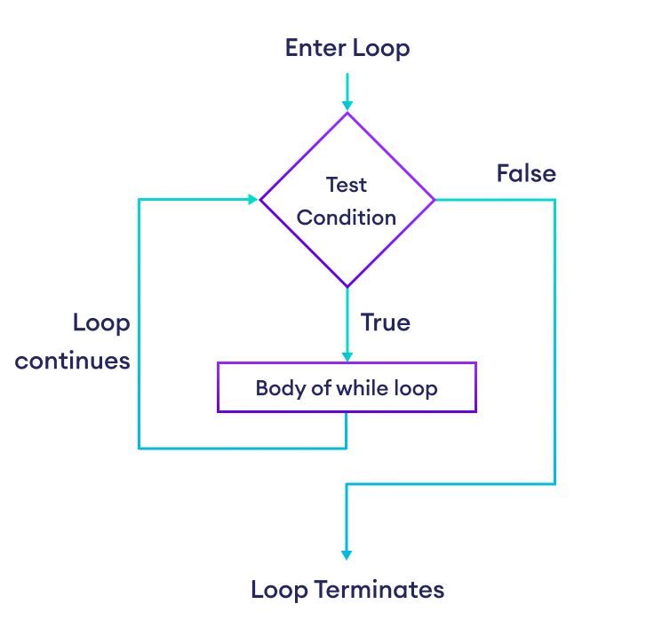

<h1>Perulangan</h1>

## Pengertian Perulangan atau `Looping`

Perulangan atau looping adalah proses yang dilakukan secara berulang-ulang. Dalam membuat program sering dihadapkan untuk menyelesaikan pernyataan yang berulang, dan bila dilakukan dengan cara manual maka membutuhkan peritah yang banyak untuk melakukan hal yang sama. Masalah tersebut dapat diselesaikan dengan menggunakan perintah perulangan atau `looping`.
Dalam bahasa pemrograman Python terdapat dua tipe perulangan yaitu `For` dan `While`. for adalah jenis *counted loop* dan while adalah jenis *uncounted loop*.

## 1. Perulangan `For`
Bentuk perulangan `for` digunakan untuk perulangan yang sudah pasti (*counted loop*).

```python
#sintak: for

for nilai in sequence:
    pernyataan
```

1. Berikut adalah contohnya menggunakan `for` dan fungsi `range`:

```python
for i in range(10):
    print(i)
```
> Output: 0, 1, 2, 3, 4, 5, 6, 7, 8, 9

2.Contoh lain penggunaan `for`

```python
#membuat list nama bulan

list_bulan = ["Januari", "Februari", "Maret", "April", "Mei", "Juni", "Juli", "Agustus", "September", "Oktober", "November", "Desember"]

for bulan in list_bulan:
    print(bulan)
```
> Output: Januari, Februari, Maret, April, Mei, Juni, Juli, Agustus, September, Oktober, November, Desember

3. For dengan `tuple`

```python
for i in ("satu", "dua", "tiga"):
    print(i)
```
> Output: satu, dua, tiga  

4. For dengan `break`

```python
for i in range(10):
    if i == 5:
        break
    print(i)
```
> Output: 0, 1, 2, 3, 4

5. For dengan `continue`

```python
for i in range(10):
    if i == 5:
        continue
    print(i)
```
> Output: 0, 1, 2, 3, 4, 6, 7, 8, 9

6. For dengan else

```python
for i in range(10):
    print(i)
else:
    print("Loop selesai")
```
> Output: 0, 1, 2, 3, 4, 5, 6, 7, 8, 9, Loop selesai

## 2. Perulangan `While`
Bentuk perulangan `while` digunakan untuk perulangan yang belum pasti (*uncounted loop*). Di dalam blok perulangan akan diulang secara terus menerus selama kondisi terpenuhi, blok akan berhentu apabila syarat untuk melakukan perulangan tidak terpenuhi untuk melakukan proses perulangan. 

```python
#sintak: while
while kondisi:
    pernyataan
```

1. Contoh penggunaan `while` tanpa batas

```python
a = 10
b = 5

while a > b:
    print("looping  ")
```
> Output: looping

Perulangan di atas tidak akan berhenti, untuk menghentikannya tekan `Ctrl + C`

2. Contoh penggunaan `while` dengan batas

```python
i = 0
while i < 10:
    print("looping")
    i = i + 1
```
> Output: looping, looping, looping, looping, looping, looping, looping, looping, looping, looping

3. Contoh list hari

```python
list_hari = ["Senin", "Selasa", "Rabu", "Kamis", "Jumat", "Sabtu", "Minggu"]
i = 0
while i < len(list_hari):
    print(list_hari[i])
    i = i + 1
```
> Output: Senin, Selasa, Rabu, Kamis, Jumat, Sabtu, Minggu

4. `while` dengan input user

```python
angka = 0
while angka < 10:
    angka = int(input("Masukkan angka: "))
```
5. `while` dengan Y atau T

```python
y = "y"
while y == "y":
    nama = input("Masukkan nama: ")
    print("Halo", nama)
    y = input("Apakah anda ingin melanjutkan (y/t)? ")
```

flowchart while


[sumber](https://www.programiz.com/python-programming/while-loop)


## Latihan
### 1. Latihan Mencari Bilangan Prima
```python
jawab = "y"
while jawab == "y":
    angka = int(input("Masukkan angka: "))
    if(angka > 1):
        for i in range(2, angka):
            if(angka % i == 0):
                print(angka, "bukan bilangan prima")
                print("Karena ", i, "adalah kelipatan dari ", angka)
        else:
            print(angka, "bukan bilangan prima")
    else:
        print(angka, "bukan bilangan prima")
    print()
    jawab = input("Apakah anda ingin melanjutkan (y/t)? ")
```

### 2. Latihan Mencari Tahun Kabisat
```python
jawab = "y"
while jawab == "y":
    angka = int(input("Masukkan angka: "))
    if(angka % 4 == 0):
        if(angka % 100 == 0):
            if(angka % 400 == 0):
                print(angka, "adalah tahun kabisat")
            else:
                print(angka, "bukan tahun kabisat")
        else:
            print(angka, "adalah tahun kabisat")
    else:
        print(angka, "bukan tahun kabisat")
    print()
    jawab = input("Apakah anda ingin melanjutkan (y/t)? ")
```

[<<Kembali](README.md)